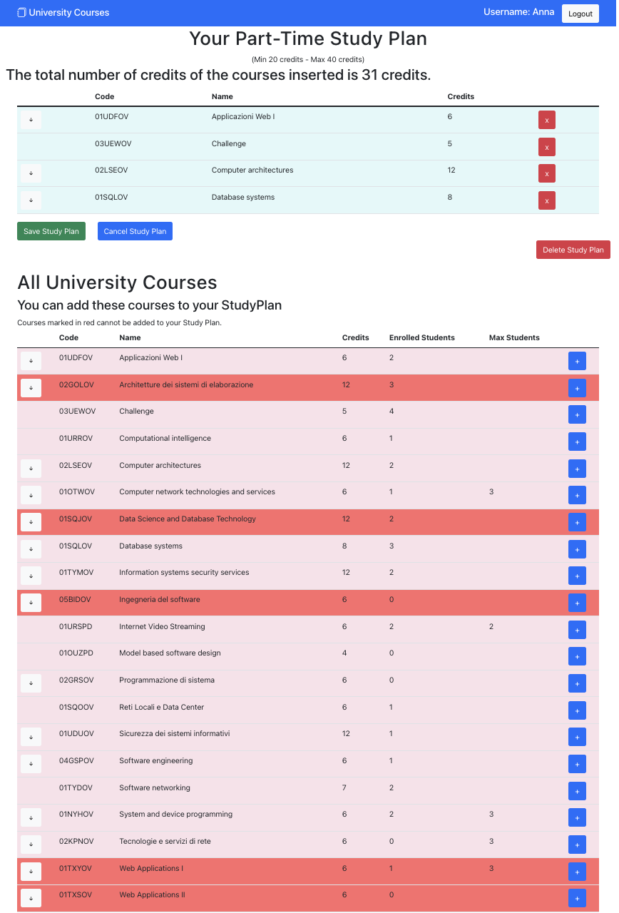

# Exam #1: "StudyPlan"
## Student: s303427 TOLA ALESSANDRO 

## React Client Application Routes

- Route `/`: homepage, with all the courses that the university offers
- Route `/studyplan`: page that contains, once logged in, the studyplan if exist and all the courses that the university offers
- Route `/login`: login form to log with authenticated username (email) and password 

## API Server

## StudyPlan APIs (6)

- POST `/api/studyplan`
  - Description: Create a new studyplan 
  - request parameters: _none_ 
  - request body: studyplan object
  - response: `201` (success) or  `500` (error) 
  - response body: _none_

- DELETE `/api/studyplan/:userId`
  - Description: Delete a studyplan 
  - request parameters: `userId` 
  - request body:  _none_
  - response: `200` (success), `404` (studyplan not found) or `500` (error) 
  - response body: _none_

- GET `/api/studyplan/:userId`
  - Description: Get the studyplan of a user by his userId
  - request parameters: `userId` 
  - request body:  _none_
  - response: `200` (success) or `500` (error) 
  - response body: studyplan objects

- GET `/api/studyplan/:userId/courses`
  - Description: Get the courses that have been added to the studyplan of a certain user
  - request parameters: `userId` 
  - request body:  _none_
  - response: `200` (success), `404` (studyplan not found) or `500` (error) 
  - response body: list of course objects

- PUT `/api/studyplan/:userId`
  - Description: Update a studyplan (add some courses)
  - request parameters: `userId` 
  - request body: studyplan object
  - response: `200` (success) or `500` (error) 
  - response body:  _none_

- PUT `/api/studyplan/:userId/delete`
  - Description: Update a studyplan (delete course)
  - request parameters: `userId` 
  - request body: object {course: course.code, credits: course.credits}
  - response: `200` (success) or `500` (error) 
  - response body:  _none_

## Courses APIs (3)
- GET `/api/courses`
  - Description: Get all the courses that the university offers
  - request parameters:  _none_
  - request body:  _none_
  - response: `200` (success) or `500` (error) 
  - response body: list of course objects

- PUT `/api/courses`
  - Description: Update the information about the enrolled students of a course (add some students to the course)
  - request parameters: _none_
  - request body: list of course codes (list of strings)
  - response: `200` (success) or `500` (error) 
  - response body:  _none_

- PUT `/api/courses/delete`
  - Description: Update the information aboute the enrolled students of a course (delete some students form the course)
  - request parameters: _none_
  - request body: list of course codes (list of strings)
  - response: `200` (success) or `500` (error) 
  - response body:  _none_

## Users APIs (5)

- POST `/api/sessions`
  - Description: Create a new session starting from given credentials
  - request parameters: _none_
  - request body: object with `username` and `password`
  - response: `200` (success) or `500` (error) 
  - response body: user object

- GET `/api/sessions/current`
  - Description: Verify if a given session is still valid and return the info about the logged-in user
  - request parameters: _none_
  - request body: _none_
  - response: `200` (success) or `500` (error) 
  - response body: user object

- DELETE `/api/sessions/current`
  - Description: Delete the current session 
  - request parameters: _none_
  - request body:_none_
  - response: `200` (success) or `500` (error) 
  - response body: _none_

- PUT `/api/user/:userId`
  - Description: Update the information about the existance of the studyplan of a user
  - request parameters: `userId`
  - request body: object with the value to update
  - response: `200` (success) or `500` (error) 
  - response body: _none_
- GET `/api/user/:userId`
  - Description:  Get the information about the existance of the studyplan of a user
  - request parameters:`userId`
  - request body:  _none_
  - response: `200` (success) or `500` (error) 
  - response body: user object

## Database Tables

- Table `Courses` - contains data about all the courses of the university.
    - code(string): code of the course, 
    - name(string): name of the course, 
    - credits(integer): number of credits, 
    - MaxStudents(integer): maximum number of students that can be enrolled i nthis course at the same time, 
    - IncompatibleWith(string): code of the courses that cannot be inserted in the studyplan together with this course, 
    - PreparatoryCourse(string): code of the course that has to be previously inserted in the studyplan in order to insert this course,
    - EnrolledStudents(integer): number of students enrolled in the course,
    - Students(string): id of the students enrolled in the course
- Table `StudyPlan` - contains data about the studyplans created by the users
    - userId(integer): id of the user that corresponds to the studyplan,
    - full_time(integer): 1 if the studyplan has been created with full time option, 0 if it is a part time studyplan,
    - mincredits(integer): minimum number of credits that the studyplan has to have,
    - maxcredits(integer): maximum number of credits that the studyplan has to have,
    - actualcredits(integer): number of credits of the studyplan corresponding to the courses inserted, 
    - courses(string): code of the courses that have been inserted in the stuydplan
- Table `User` - contains data about the users that are authenticated 
    - id(integer): id of the user,
    - email(string): email of the user,
    - password(string): hash of the password,
    - salt(string): salt used to encrypt the password,
    - studyplan(integer): 1 if the user has created a studyplan, 0 if the user hasn't a studyplan

## Main React Components

- `App` (in `App.js`): main component with all the routes, useState and main functions to modify the studyplan

- `DefaultRoute` (in `CourseViews.js`): default component in case of wrong url
- `CourseRoute` (in `CourseViews.js`): component that correspond to the route of the homepage for an unauthenticated user
- `StudyPlanRoute` (in `CourseViews.js`): component that correspond to the route of the homepage for an authenticated user after the login
- `LoginRoute` (in `CourseViews.js`): component that correspond to the login page

- `MyNavbar` (in `NavBar.js`): navbar of the entire application
- `LogButtons` (in `NavBar.js`): login and logout buttons shown on the right of the navbar

- `LoginForm` (in `AuthComponents.js`): form used to insert email and password by the user to login

- `CourseTable` (in `CourseTable.js`): table that contains all the courses that the university offers
- `CourseRow` (in `CourseTable.js`): settings of the row of CourseTable and his functionalities (action buttons, clolour and expansion)
- `CourseData` (in `CourseTable.js`): data information about the course of CourseRow
- `ExpandedData` (in `CourseTable.js`): course description (incompatible course and preparatory course) of the course of CourseRow
- `CourseActions` (in `CourseTable.js`): button to add the course to the studyplan
- `ExpandActions` (in `CourseTable.js`): button to expand the description of the course

- `StudyPlanTable` (in `StudyPlanTable.js`): table that contains all the courses that have been inserted into the studyplan

- `StudyPlanForm` (in `StudyPlanForm.js`): form to create a new studyplan in which we can choose between full-time / part-time

(only _main_ components, minor ones may be skipped)

## Screenshot

## Users Credentials
- student@studenti.polito.it -> password: password 
- test@polito.it -> password: testtest 
- jimmy@polito.it -> password: jimmyjimmy
- anna@studenti.polito.it -> password: redcar
- james123@studenti.polito.it -> password: coolpassword